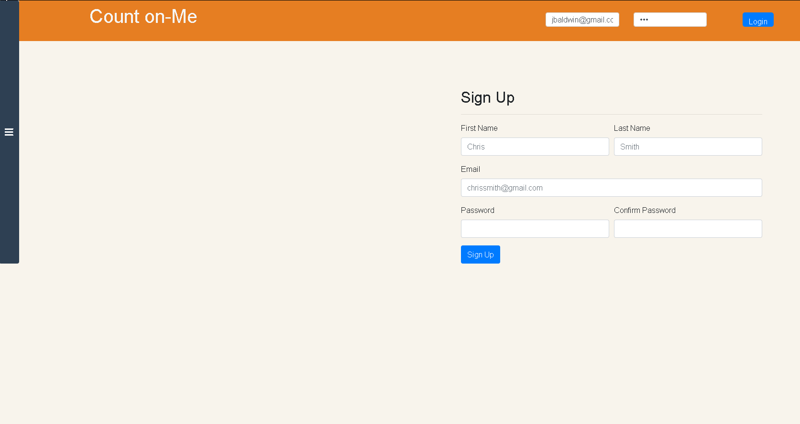

"Count on-Me" is a goal tracking social media app that allows users to create and complete goals and interact with other user by following, viewing their goals and commenting on their posts.

Contributors : Stephanie Blom, Koustub Manchiraju, Majid Paktinat, Sahar Sagharichi

Login/ Home PAge

Setting Goals

Features: 
    - Create Account
    - Login
    - Upload Profile Picture
    - Add Goals
    - Complete Goals
    - Follow users
    - Visit Friends Page
    - Comment on User Posts
    - Toastr Notifications when user comments
    - Settings ( change user info )

Tech used :
    - React
    - Node.JS
    - Express
    - MongoDB / Mongoose
    - Multer
    - Socket.io
    - Heroku

    https://goaltracke.herokuapp.com/